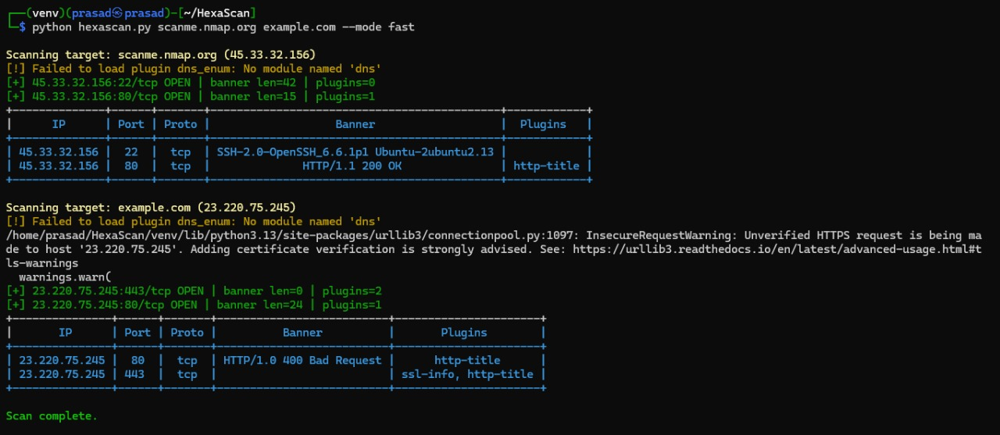
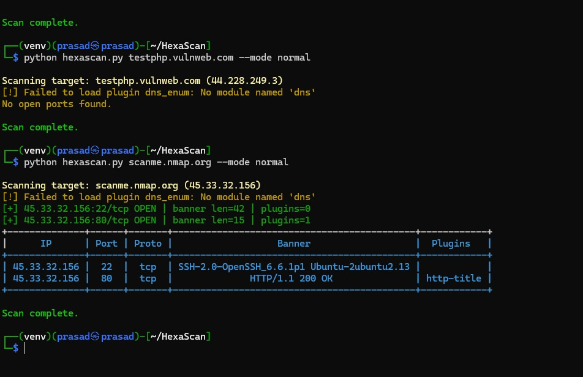
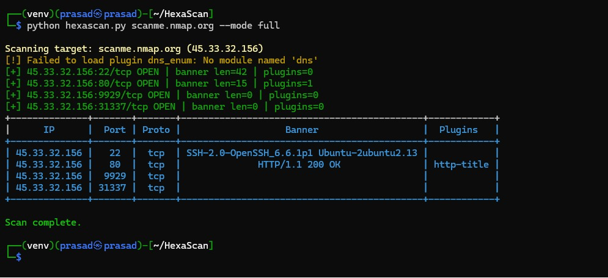

# ⚡ HexaScan

<p align="center">
  <b>Advanced Port Scanning & Service Enumeration Tool</b>
  <br>
  Cross-platform | Plugin Support | Web Dashboard
</p>

---


---

## 📖 About

**HexaScan** is an **advanced port scanning and service enumeration tool** with **plugin support**.
It is designed for **beginners and professionals** to quickly discover:
- 🔍 Open ports
- 🖥️ Running services
- ⚠️ Weak configurations

With modes like **Normal, Fast, Full Scan** and a **Flask-based Web Dashboard**, HexaScan gives you flexibility for lightweight checks or deep network assessments.

---

## 📑 Table of Contents
- [✨ Features](#-features)
- [📥 Installation](#-installation)
- [⚡ Usage](#-usage)
- [🔌 Plugins](#-plugins)
- [📂 Project Structure](#-project-structure)
- [🛠 Troubleshooting](#-installation-troubleshooting-kaliubuntu-pep-668)
- [📌 Why venv?](#-why-venv)
- [🔮 Future Improvements](#-future-improvements)
- [🤝 Contributing](#-contributing)
- [📄 License](#-license)
- [⚠️ Disclaimer](#-disclaimer)
- [📌 Note](#-note)

---

## ✨ Features

- 🚀 **Fast & Advanced Port Scanning** (Normal, Fast, Deep modes)
- 🔌 **Plugin System** for service enumeration
  - DNS, FTP, HTTP, MySQL, MongoDB, RDP, SMB, SSL checks
- 📊 **Flask Web Dashboard** for visualizing results
- 💾 **Save results as JSON** for further analysis
- 🌐 **Cross-platform support** (Windows, Linux, Termux/Android)

---
## 📸 Screenshots

### 🔹 Reports
<p align="center">
  
  
  
</p>

## 📥 Installation

### 🔹 Termux (Android)
```bash
pkg update && pkg upgrade
pkg install python git
git clone https://github.com/Prasadsarkate/HexaScan
cd HexaScan
pip install -r requirements.txt
```

### 🔹 Linux (Kali/Parrot/Ubuntu)
```bash
sudo apt update && sudo apt install -y python3 python3-pip git
git clone https://github.com/Prasadsarkate/HexaScan
cd HexaScan
pip install -r requirements.txt
```

### 🔹 Windows
1. Install [Python 3](https://www.python.org/downloads/)
2. Install [Git](https://git-scm.com/download/win)
3. Run in **PowerShell / CMD**:
```powershell
git clone https://github.com/Prasadsarkate/HexaScan
cd HexaScan
pip install -r requirements.txt
```

---

## ⚡ Usage

### 🔹 Normal Scan
```bash
python hexascan.py target.com --mode normal
```

### 🔹 Fast Scan
```bash
python hexascan.py target.com --mode fast
```

### 🔹 Deep Scan
```bash
python hexascan.py target.com --mode full
```

### 🔹 Save Output to JSON
```bash
python hexascan.py target.com --mode full --output json --out-file results.json
```

### 🔹 Web Dashboard
```bash
python dashboard.py
```
👉 Open in browser: [http://127.0.0.1:5000](http://127.0.0.1:5000)

---

## 🔌 Plugins

| Plugin       | Description | Example |
|--------------|-------------|---------|
| `dns_enum`   | DNS record enumeration | `--plugins dns_enum` |
| `ftp_anon`   | Checks anonymous FTP login | `--plugins ftp_anon` |
| `http_title` | Grabs HTTP page title | `--plugins http_title` |
| `mysql_check`| Tests MySQL weak configs | `--plugins mysql_check` |
| `mongo_check`| Tests MongoDB weak configs | `--plugins mongo_check` |
| `rdp_check`  | RDP availability | `--plugins rdp_check` |
| `smb_enum`   | Enumerates SMB shares | `--plugins smb_enum` |
| `ssl_info`   | Extracts SSL certificate info | `--plugins ssl_info` |

---

## 📂 Project Structure

```
HexaScan/
├── hexascan.py       # Main scanner
├── dashboard.py      # Flask web dashboard
├── plugins/          # Service enumeration modules
├── results.json      # Example results
├── requirements.txt  # Dependencies
└── README.md
```

---

## 🔮 Future Improvements
- Add multi-threaded scanning for better performance
- Export results to CSV & HTML reports
- Integration with ElasticSearch / Splunk
- Advanced visualization dashboard
- Plugin marketplace system

---

## 🤝 Contributing

Contributions, issues, and feature requests are welcome!
1. Fork the repo
2. Create a new branch (`feature-xyz`)
3. Commit your changes (`git commit -m "Add new feature"`)
4. Push to branch (`git push origin feature-xyz`)
5. Open a Pull Request

⭐ Don’t forget to **star this repo** if you find it useful!

---

## 📄 License

Distributed under the **MIT License**.
See `LICENSE` for more details.

---

## ⚠️ Disclaimer

HexaScan is intended for **educational and authorized security testing only**.
Do not use this tool on systems or networks without explicit permission.

---

## 📌 Note

This tool was previously named **`skan`**, and has now been renamed to **HexaScan** for a better identity.
